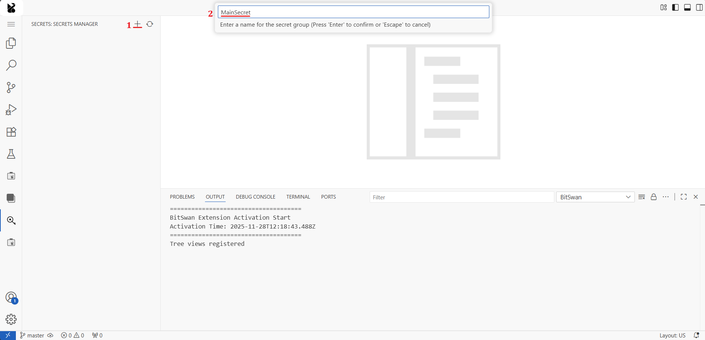
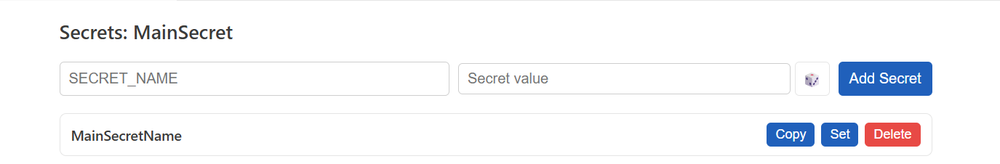

# BitSwan Automations 

BitSwan is a platform for building automations and microservices directly in Jupyter Notebooks, and deploying them with a single click.

**Key Use Cases:**
- Automation of processes
- Batch / real-time processing of data
- Simple web applications

## Jupyter notebooks
- Step‑by‑step execution: run cells interactively to debug each step
- Clear separation: code, text, and outputs in one place

## What is a BitSwan automation

A BitSwan automation processes events from a Source, runs them through a sequence of notebook cells (steps), and emits results via a Sink.

**How it works:**

  flowchart LR
    A[Source] --> B[Cells / Steps]
    B --> C[Sink]

- **Source**: where events come from (e.g., WebForm, Webhook, Kafka, Cron/time trigger)
- **Cells**: cells after `auto_pipeline(...)` process each event in order
- **Sink**: where side‑effects happen (e.g., HTTP call, DB write, file/log)

## Types of automations (triggers)

### Time-triggered automations
Automations that run on a schedule using cron expressions. Ideal for periodic tasks, reporting, cleanup jobs, and scheduled notifications.

**CronSource** (`examples/TimeTrigger`): Triggers pipelines based on cron expressions (e.g., every Monday at 14:20). Built on `CronTrigger` for stable time-based scheduling.

### Manually triggered automations
Automations that wait for user input or HTTP requests. Perfect for web forms, REST APIs, and interactive tools.

**WebFormSource** (`examples/WebForms`): Serves a web form with various field types (text, number, date, checkboxes, repeatable lists). Processes form submissions asynchronously.

**ProtectedWebFormSource** (`examples/ProtectedWebForm`): Web form protected with a secret key. 

### Event-triggered automations
Automations that react to messages from streaming platforms, message queues, or real-time data sources. Best for event-driven architectures and data pipelines.

**KafkaSource**  (`examples/Kafka2Kafka`): Consumes events from Kafka topics. Processes and optionally forwards to other Kafka topics or systems.

### File and storage based automations
Automations that read files, directories or remote storage

**FileField** (`examples/Filefield`): Example of how to add a file upload field to a webform and handle uploaded files in your automation

## Project structure (suggested)
```
automation/
  main.ipynb                # main notebook
  pipelines.conf            # defines connections & config for sources, sinks, secrets, and pipelines
  image/
    Dockerfile              # ~ can be used to install extra dependencies for the notebook. 
```

- `main.ipynb`: the primary notebook where `auto_pipeline(...)` is called. Cells below it implement the processing steps; helper functions (or imports of helper functions) are typically defined before the `auto_pipeline(...)` call.
- `pipelines.conf`: wiring/configuration for sources, sinks, deployments, and secrets.
- `Dockerfile`: usually very small; the runtime environment is imported and a few extra packages are installed. 

## `auto_pipeline` anatomy
The notebook typically has:
1) Imports and helper functions 
2) `auto_pipeline(...)` call to register Source and Sink
3) Cells after `auto_pipeline(...)` that process each event

**CELL 1: Example imports**
```python
from bspump.jupyter import *
from bspump.http.web.server import *
from bspump.cron import CronSource
from bspump.common.print import PPrintSink
```

**CELL 2: auto_pipeline call**
```python
# Example: WebForm pipeline
auto_pipeline(
    source=lambda app, pipeline: ProtectedWebFormSource(
        app, pipeline, route="/",
        fields=[
            # ... define fields, e.g. TextField("subject") 
            #  more in: bspump\http\web\components
        ],
        config={"secret": os.getenv("WEBFORM_SECRET", "")}
    ),
    sink=lambda app, pipeline: WebSink(app, pipeline),
    name="FormPipeline"
)
# ... cells below run for each incoming form submission
# event["form"] contains submitted data; set event["content_type"] if returning a body
```
**Alternate CELL 2: auto_pipeline call with a CronSource**
```python
# Example: Cron pipeline
auto_pipeline(
    source=lambda app, pipeline: CronSource(app, pipeline, config={"when": "20 14 * * 1"}),
    sink=lambda app, pipeline: PPrintSink(app, pipeline),
    name="WeeklyPipeline"
)

# ... cells below run on schedule and emit via Sink
```

Note: Locally, create and activate a Python venv and ensure imports resolve. Dependency management is usually defined in your project (e.g., `pyproject.toml`). In AOC, the same imports work inside the runtime environment image.

### Event object (common patterns)
- Dict‑like; typical keys include `event["form"]`, `event["payload"]`, `event["content_type"]`
- Cells can add/modify keys; the Sink consumes them (e.g., `payload`)

Tip: during development, simulate events to enable step‑by‑step execution of cells (e.g., set `event = {...}` or use helpers like `sample_events([...])`).

## Dependencies and build

- Dockerfile: build an image for AOC with your minimal extra deps installed

`Dockerfile` (typical deployed automation)
```dockerfile
FROM bitswan/pipeline-runtime-environment:2025-17915492359-git-e5c422a #image with which was the automation created
RUN pip install -U openai #Further installs for the automations container
```

## Configuration with `pipelines.conf`
Role: holds environment/config for your automation, wiring sources, sinks, deployments, and secrets.

Examples:

- Deployed automation (typical):
  ```ini
  [deployment]
  pre=internal/<AutomationName> # this is where the Dockerfile gets imported
  expose=true
  ```

Secrets in `pipelines.conf` reference secret groups backed by the groups you've created in your `secrets` tab.

### Secrets

- In AOC: secrets are mounted under a shared path and exposed to the runtime
- Create a secret group in secrets

#### Managing Secrets in the VS Code Extension

The BitSwan extension provides a **Secrets Manager** in the sidebar for managing secret groups and their values.

**Creating a Secret Group:**

1. Open the **Secrets** tab in the sidebar
2. Click the **+** button (marked ①) to create a new secret group
3. Enter a name for the group in the input field



**Adding Secrets to a Group:**

1. Click on a secret group to open it
2. Enter the secret name and value:
   - Type the name (marked ①) and the secret in the Secret value field (marked ②)
   - Alternativelly click **Generate Random** (marked ③) to create a random secret value if there is none yet
3. Click **Add Secret** to create a new secret


**Managing Secrets:**

Once created, you can:
- Add new secrets using the **Add Secret** button
- Edit existing secrets by clicking one of the buttons near the given secret



**Reference in `pipelines.conf`:**

After creating secret groups, reference them in your `pipelines.conf`:

```ini
[secrets]
groups = group_name1, group_name2
``` 

## Custom PRE
A PRE is a pre‑built component/image you can reference from your automation (e.g., custom sources/sinks/utilities). Where to register and how to author a PRE depends on your environment.

## Tooling

### BitSwan VS Code extension
- Location: left sidebar 
- Automations: view active/inactive; restart, pause, stop; view logs

## Debugging & testing
- Run step‑by‑step in Jupyter (execute cells interactively)

## Deployment
- Click "Deploy Automation" in the extension/ in AOC
- Verify it's running in the extension or AOC
- Check logs and metrics to confirm healthy operation

## Automation Server and AOC (overview)

- **Automation Server**: runtime environment where BitSwan automations and microservices are deployed and executed.
  - Runs on a Linux machine with Docker.
  - Can host multiple workspaces, providing isolation between projects and teams
  - Modes:
    - Standalone – fully functional for development and deployment of automations
    - Connected to AOC – integrates with the Automation Operation Center (AOC) for advanced monitoring, process specification, and management features
  - Even when not connected to the AOC, the Automation Server runs 100% autonomously.

- **Workspace / Runspace**: logical separation unit designed to isolate automations, users, and resources.
  - GitOps – manage running automations: deploy, restart, pause, or delete automations; access and monitor logs
  - BitSwan Editor – customized VS Code server with the BitSwan extension: develop and test automations/microservices using the BitSwan Python library and Jupyter; deploy automations with a single click
  - User Management – workspaces are the central building block of user access management

- **Automation Operation Center (AOC)**: centralized visibility and management of BitSwan deployments.
  - Define and specify processes
  - Manage and monitor automations
  - Administer automation servers and workspaces
  - Control user access and roles
  - When connected, Automation Servers and their workspaces continuously send information about deployed automations to the AOC.

Deployment models: Full Cloud, Hybrid, On‑Premise more: https://github.com/bitswan-space 

