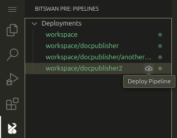
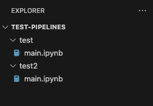

# bitswan-pre

A VS Code extension that provides a way to interact with the Bitswan runtime, allowing you to simply deploy and manage your pipelines.

## Features

A simple way to deploy and manage your pipelines.\
You can easily deploy your pipeline by clicking the upload button in the new Bitswan tab in the sidebar, as seen in the image below.



This allows you to deploy either pipeline `test` or `test2` by clicking on the corresponding upload button. Possible deployments are discovered from the currently opened folder, where the extension looks for all subfolders containing `pipelines.conf` files. For example, following folder structure would allow you to deploy `test` and `test2` pipelines:



Pipelines get deployed to the url specified either by environment variable `BITSWAN_DEPLOY_URL`, or by specifying it in the popup that appears after clicking the upload button.

## Development

In case you are developing. You can use `vsce` to easily package and publish your extensions. 
You need to have Node.js installed.
Then run
```sh
npm install -g vsce
```

In case you want to create `.vsix`, you can do so by entering the root of repository and running 
```shell
vsce package
```
This will create `myExtension.vsix`, which you can then install in your Visual Studio Code.

