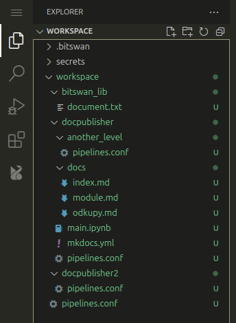

# bitswan-pre

A VS Code extension that provides a way to interact with the Bitswan runtime, allowing you to simply deploy and manage your pipelines.

## Features

A simple way to deploy and manage your pipelines.\
You can easily deploy your pipeline by clicking the upload button in the new Bitswan tab in the sidebar, as seen in the image below.

This allows you to deploy either pipeline `test` or `test2` by clicking on the corresponding upload button. Possible deployments are discovered from the currently opened folder, where the extension looks for all subfolders containing `main.ipynb` files. For example, following folder structure would allow you to deploy `test` and `test2` pipelines:

Pipelines get deployed to a url specified either by environment variable `BITSWAN_DEPLOY_URL`, or by specifying it in the popup that appears after clicking the upload button.

